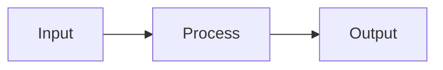
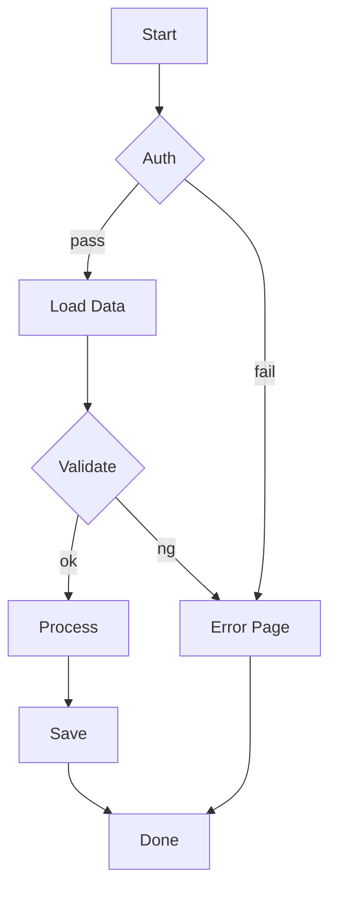
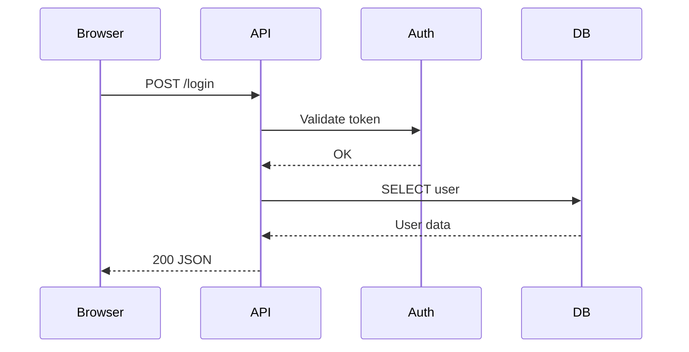

# moomaid

Mermaid diagram renderer written in MoonBit. Outputs ASCII art or SVG.

## Install

```bash
moon add mizchi/moomaid
```

## CLI

```bash
# Render from file
just cli diagram.mmd
just cli --svg diagram.mmd

# Render from stdin
echo 'graph LR
  A --> B --> C' | just cli-stdin

# Sequence diagram from stdin
cat <<EOF | just cli-stdin
sequenceDiagram
  participant Client
  participant API
  participant DB
  Client->>API: Request
  API->>DB: Query
  DB-->>API: Result
  API-->>Client: Response
EOF
```

### Options

```
--svg          Output SVG (default: ASCII)
--ascii        Output ASCII art
--width <n>    Max width for ASCII (default: 80)
--help         Show help
```

## Diagram Types

### Flowchart (`graph LR` / `graph TD`)

Use for visualizing data flow, module dependencies, and process graphs.





### Sequence Diagram (`sequenceDiagram`)

Use for describing layer boundaries and API call flows.



### Other supported types

- `stateDiagram-v2` - State machine diagrams
- `classDiagram` - Class diagrams

## Library Usage

```moonbit
let svg = @moomaid.render_mermaid("graph LR\n  A --> B")

let options : @moomaid.AsciiRenderOptions = {
  use_ascii: false,
  padding_x: 2,
  padding_y: 1,
  box_border_padding: 1,
  max_width: 80,
}
let ascii = @moomaid.render_mermaid_ascii("graph LR\n  A --> B", options~)
```

## TUI Viewer

Interactive terminal viewer with tab switching and Kitty graphics protocol support.

```bash
just tui
```

- `Tab` / `Shift+Tab`: Switch diagrams
- `Up` / `Down`: Scroll
- `s`: Toggle ASCII / SVG mode (Kitty-compatible terminals)
- `q`: Quit

## License

Apache-2.0
